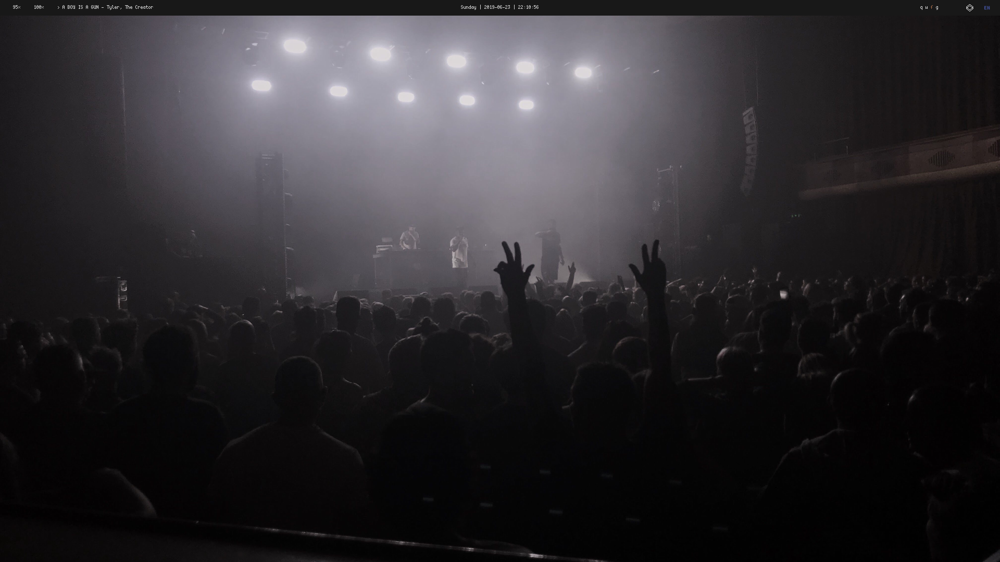
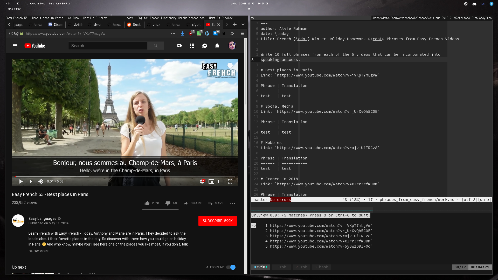
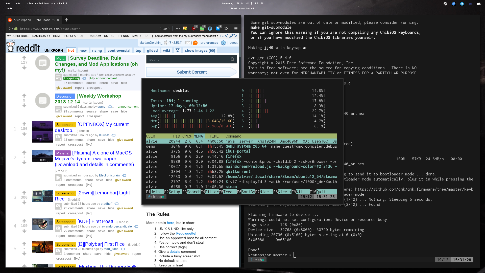
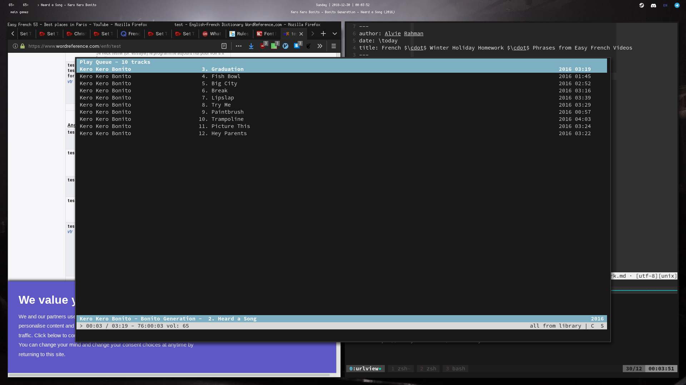

# dotfiles
clone with `--recurse-submodules` flag

## Applications

- Music: cmus
- File Manager: thunar + ranger
- Terminal: st
- Web browser: firefox
- Editor: vim
- WM: i3-gaps
- Volume control: pavucontrol
- Bars: polybar
- BitTorrent client: qbittorrent

`cmus thunar ranger firefox vim firefox pavucontrol qbittorrent`

### Terminal

[My Suckless Terminal](https://github.com/alvierahman90/st)
